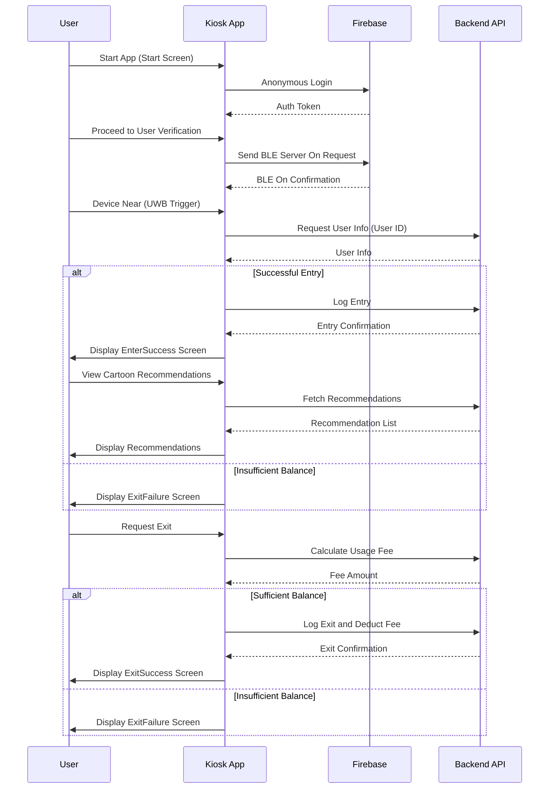

# Kiosk App - Cartoon Time

**Cartoon Time**은 **Electron**과 **React**로 제작된 키오스크 애플리케이션으로, 사용자에게 맞춤형 만화책 추천과 결제, 출입 관리 기능을 제공합니다. Firebase 인증과 FCM(푸시 알림)을 통해 사용자의 접근과 활동을 효율적으로 관리하며, 전용 `Ultra-Wideband(UWB)` 기술을 통해 간편한 인증을 지원합니다.

## Project Overview

Cartoon Time은 전용 키오스크 환경에서 사용자에게 만화책 추천과 위치 안내 기능을 제공하는 애플리케이션입니다. 간단한 터치 인터페이스와 직관적인 UI로 사용자 친화적인 경험을 제공하며, UWB 기술을 활용해 모바일 장치와의 상호작용을 기반으로 빠르고 안전하게 사용자 인증 및 결제를 수행합니다.

<!-- ## Table of Contents
1. [Project Overview](#project-overview)
2. [Features](#features)
3. [Installation and Setup](#installation-and-setup)
4. [Main Components](#main-components)
5. [Build and Distribution](#build-and-distribution)
6. [Folder Structure](#folder-structure)
7. [Contributing](#contributing)
8. [License](#license) -->

## Screen

앱의 주요 화면을 아래에서 확인할 수 있습니다:

### 키오스크 시작 화면

### 유저 인증

### 만화 추천

## Features

- **Firebase 익명 로그인**: Firebase 인증을 이용한 손쉬운 익명 로그인 기능
- **맞춤형 만화 추천**: 사용자 선호도, 인기 만화, 오늘의 추천 만화를 제공
- **입출입 관리**: UWB 기술을 통해 사용자의 입실과 퇴실을 기록하고 관리
- **결제 시스템**: 만화 사용 시간에 따라 요금을 계산하고 결제를 진행
- **만화 위치 안내**: 만화 위치를 지도로 보여주며, 필요한 경우 안내 메시지 전송
- **배포 및 업데이트**: GitHub Release와 연동된 Electron Forge로, 지속적인 업데이트와 배포 지원

## Application Flow

### 흐름도 설명

- **앱 시작**: 사용자가 앱을 실행하면 Firebase를 통해 익명 로그인이 진행됩니다.
- **사용자 인증**: 사용자가 기기에 가까이 가면 UWB가 활성화되어 BLE 서버가 켜집니다. 이후 서버에서 사용자 정보를 가져옵니다.
- **입실 성공**: 입실 성공 시 서버에 로그를 기록하고 추천 만화 리스트를 표시합니다.
- **퇴실 과정**: 사용자는 퇴실 요청을 하고, 서버에서 요금 계산 후 잔액을 확인합니다. 잔액이 충분하면 요금을 차감하고 퇴실을 확인합니다. 부족하면 퇴실 실패 메시지를 표시합니다.

위 코드를 README에 넣으면 프로젝트의 흐름을 직관적으로 표현할 수 있습니다. Mermaid는 GitHub에서도 지원되므로 README에서 바로 확인 가능합니다.
