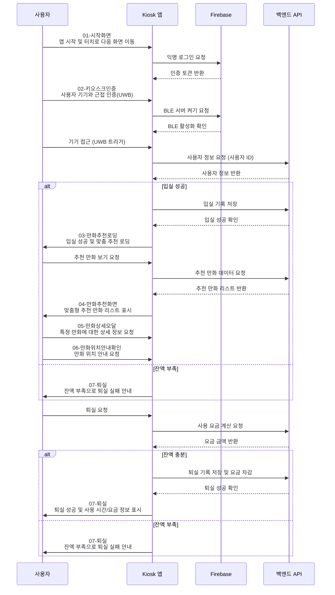

# Kiosk App - Cartoon Time

**Cartoon Time**은 **Electron**과 **React**로 제작된 키오스크 애플리케이션으로, 사용자에게 맞춤형 만화책 추천과 결제, 출입 관리 기능을 제공합니다. Firebase 인증과 FCM(푸시 알림)을 통해 사용자의 접근과 활동을 효율적으로 관리하며, 전용 `Ultra-Wideband(UWB)` 기술을 통해 간편한 인증을 지원합니다.

## 개요

Cartoon Time은 전용 키오스크 환경에서 사용자에게 만화책 추천과 위치 안내 기능을 제공하는 애플리케이션입니다. 간단한 터치 인터페이스와 직관적인 UI로 사용자 친화적인 경험을 제공하며, UWB 기술을 활용해 모바일 장치와의 상호작용을 기반으로 빠르고 안전하게 사용자 인증 및 결제를 수행합니다.

## 페이지 및 기능 설명

### 01-시작화면

앱을 처음 시작하는 화면입니다. 사용자는 화면을 터치하여 다음 단계로 이동합니다.

---

### 02-키오스크인증

UWB 기반의 기기 근접 인증을 통해 사용자를 식별하고, 입실 및 퇴실 절차를 시작합니다.

---

### 03-만화추천로딩

사용자 맞춤형 추천 만화를 불러오는 동안 로딩 상태를 표시합니다.

---

### 04-만화추천화면

사용자 선호도, 인기 만화, 오늘의 추천 만화와 같은 맞춤형 추천 리스트를 제공합니다.

---

### 05-만화상세모달

선택한 만화에 대한 상세 정보(작가, 장르, 위치)를 모달로 표시합니다.

---

### 06-만화위치안내확인

선택한 만화의 위치 안내를 요청하기 전에 확인 메시지를 표시합니다. 위치 안내 시 핸드폰 앱에서 확인 가능합니다.

---

### 07-퇴실

사용자의 퇴실 절차를 완료하고 요금과 사용 시간을 표시합니다. 잔액이 부족할 경우 퇴실 실패 메시지를 안내합니다.

## 주요 기술적 기능

- **Firebase 익명 로그인 및 인증**: 사용자가 손쉽게 로그인할 수 있도록 Firebase를 통한 익명 로그인 방식을 채택하였습니다. Firebase에서 반환된 인증 토큰을 이용해 앱 내에서 사용자 세션을 관리하고, 출입 기록을 연동합니다.
- **UWB 기반 입출입 관리**: Ultra-Wideband(UWB) 기술을 통해 사용자가 키오스크와 근접할 때 자동으로 인증됩니다. BLE(Bluetooth Low Energy)를 활성화하고 파이어베이스와 연동하여 UWB 신호를 통해 출입이 기록됩니다.

- **실시간 데이터 송수신 (IPC)**: Electron의 `ipcRenderer`와 `ipcMain` 모듈을 사용하여 메인 프로세스와 렌더러 프로세스 간의 실시간 데이터 통신을 구현하였습니다. 사용자의 요청을 메인 프로세스에서 처리하고, API 요청, BLE 활성화 등의 작업을 수행하여 필요한 데이터를 전송합니다.

- **사용 시간 및 요금 계산**: 입실 시간과 퇴실 시간에 기반하여 사용 시간을 계산하고, 분당 요금이 부과되도록 구현되었습니다. 이 계산 로직은 백엔드와 연동하여 실시간으로 요금이 자동 계산되며, 잔액 확인 후 퇴실 여부가 결정됩니다.

- **Firebase Cloud Messaging(FCM) 알림 전송**: FCM을 활용하여 만화 위치 안내 및 결제 요청 등 푸시 알림을 전송합니다. 사용자는 만화의 위치를 안내받거나, 퇴실 시 알림을 통해 퇴실 절차를 안내받을 수 있습니다.

- **Electron Forge를 통한 패키징 및 배포 자동화**: `forge.config.ts`에서 설정된 Electron Forge를 통해 앱을 손쉽게 빌드 및 배포할 수 있도록 하였으며, GitHub Release와 연동하여 자동 업데이트가 가능합니다.

## 애플리케이션 흐름도

### 흐름도 설명

- **앱 시작**: 사용자가 앱을 실행하면 Firebase를 통해 익명 로그인이 진행됩니다.
- **사용자 인증**: 사용자가 기기에 가까이 가면 UWB가 활성화되어 BLE 서버가 켜집니다. 이후 서버에서 사용자 정보를 가져옵니다.
- **입실 성공**: 입실 성공 시 서버에 로그를 기록하고 추천 만화 리스트를 표시합니다.
- **퇴실 과정**: 사용자는 퇴실 요청을 하고, 서버에서 요금 계산 후 잔액을 확인합니다. 잔액이 충분하면 요금을 차감하고 퇴실을 확인합니다. 부족하면 퇴실 실패 메시지를 표시합니다.
